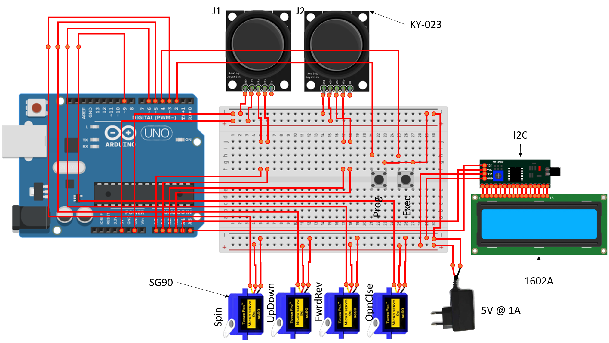
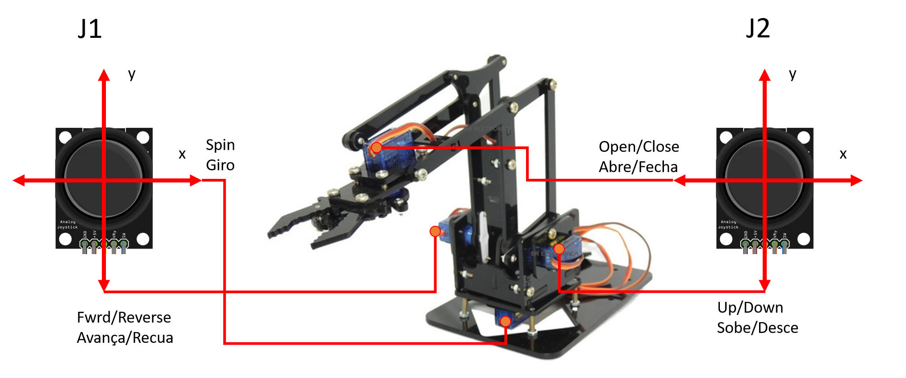

# Automatic moving for robotic arm with servo SG90 (Movimentação automatica com o servo SG90)

Automatic moving for robotic arm with servo SG90
Movimentação automatica com o servo SG90

## Features (Características)

1. Store moviment
2. Incremental moviment (jog)
3. Automatic moviment
4. Display LCD with status

1.Armazenar movimento
2.Movimento incremental
3.Movimento automático
4. Display LCD para exibir o status

## Getting Started (Iniciando)

These instructions will get you a copy of the project up and running the file **RoboticArm.ino** in the Arduino IDE on your local machine for development and testing purposes.
Compile and load to Arduino board

Faça uma cópia de todo o projeto e execute o arquivo **RoboticArm.ino** no Arduino IDE em sua máquina de desenvolvimento e testes. 

### Prerequisites (Pré-requisitos)

Aduino IDE
Arduino UNO or superior

## Running the tests (Executando os testes)
1. Mount circuit based on attached diagram
2. Compile the file **RoboticArm.ino** in the Arduino IDE
3. Load to Arduino board

1. Monte o circuito baseado no diagrama anexo
2. Compile o arquivo **RoboticArm.ino** no Arduino IDE
3. Carregue para a a Placa Arduino

Wire diagram

Mounting

## Authors

**Emerson J. Silva** and **Elian P. S. Almeida**

## License

This project is licensed under the GLP License
